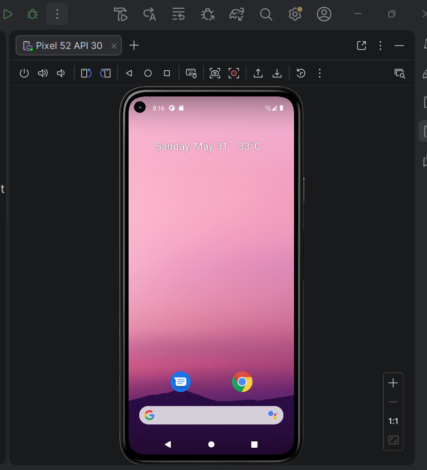
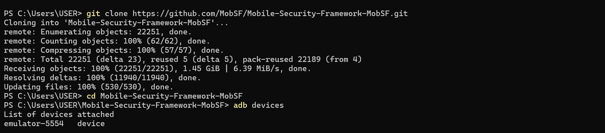
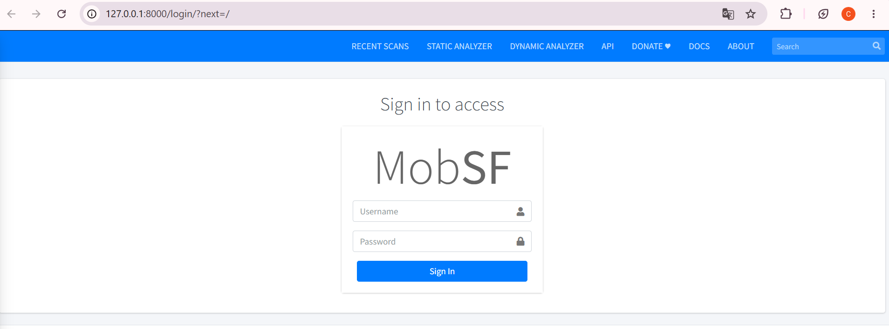
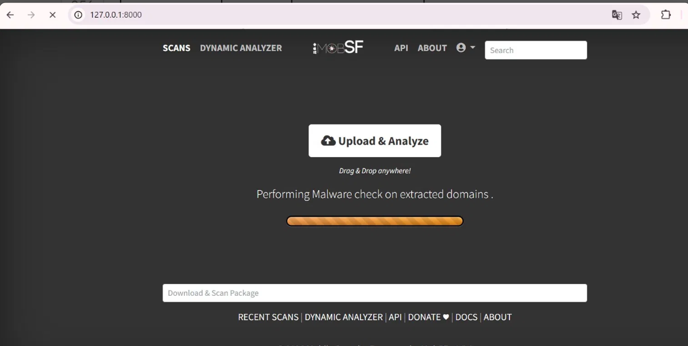
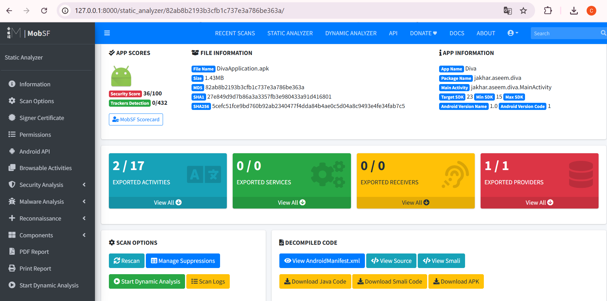
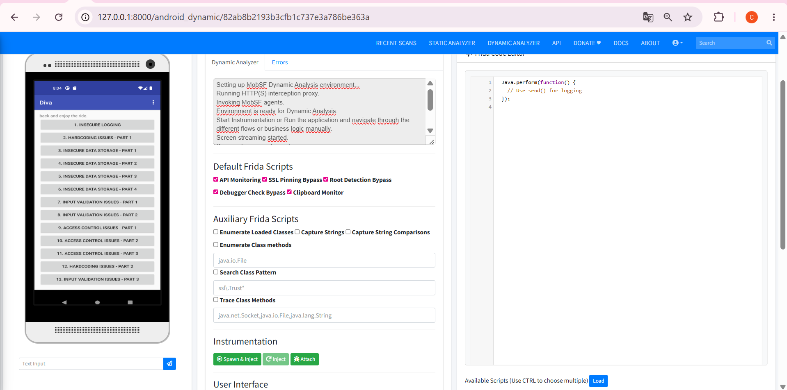
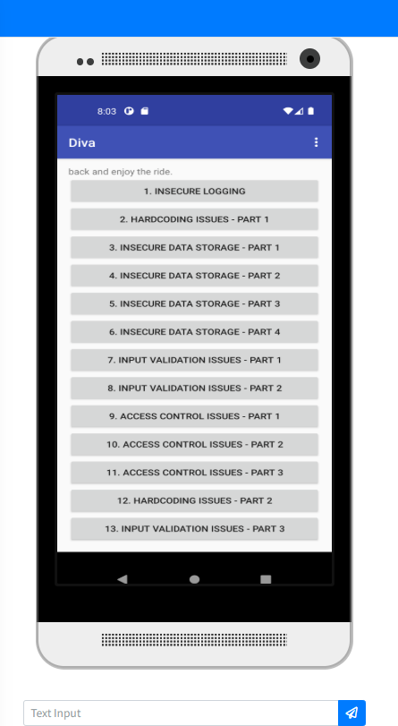

# LAB 7 — Analyse Dynamique Mobile avec MobSF
**Cours :** Sécurité des applications mobiles  
**Étudiante :** CHAIMAA ELGADAOUI
**Outil principal :** Mobile Security Framework (MobSF) v4.5  

---

##  Objectifs du lab

- Configurer un émulateur Android propre (sans Google Play) compatible MobSF
- Installer et lancer MobSF via Docker
- Analyser statiquement et dynamiquement l'APK vulnérable DIVA
- Observer en temps réel les vulnérabilités : logs, trafic réseau, Frida, stockage insecure
- Générer un rapport d'analyse complet


---

## Prérequis

Avant de commencer le lab, j'ai vérifié que les outils nécessaires étaient bien installés en ouvrant un terminal PowerShell et en tapant les commandes suivantes :

```powershell
adb --version
docker --version
git --version
```

| Outil | Version installée | Rôle |
|-------|-------------------|------|
| ADB (Android Debug Bridge) | 1.0.41 — v37.0.0 | Communication avec l'émulateur Android |
| Docker Desktop | 29.4.2 | Conteneurisation de MobSF |
| Git | 2.53.0 (Windows) | Clonage du dépôt MobSF |

Les trois outils étaient opérationnels dès le départ. L'ADB était installé séparément dans `C:\platform-tools\`, ce qui est parfaitement fonctionnel.

---

## Étape 1 — Création de l'émulateur AVD sans Google Play

### Pourquoi sans Google Play ?

Un émulateur avec Google Play embarque des services Google en arrière-plan (Firebase, Play Services) qui génèrent du trafic réseau parasite. Pour l'analyse de sécurité, on veut un environnement propre où seul le trafic de l'application testée est visible. De plus, MobSF nécessite un émulateur rootable, ce qui est impossible avec les images Google Play.

### Ce que j'ai fait
J'ai sélectionné **Google APIs Intel x86_64 Atom System Image — API 30** et téléchargé l'image.

### Résultat


*L'AVD "Pixel 52" API 30 Android 11.0 x86_64 apparaît dans la liste — sans Google Play*

| Paramètre | Valeur |
|-----------|--------|
| Nom AVD | Pixel 52 |
| API Level | 30 (Android 11.0 "R") |
| Architecture | x86_64 |
| Services | Google APIs uniquement (sans Play Store) |
| Statut | ✅ Créé et fonctionnel |

---

## Étape 2 — Clonage du dépôt MobSF

Pour disposer des scripts officiels MobSF (notamment pour la configuration de l'émulateur), j'ai cloné le dépôt GitHub :

```powershell
cd C:\Users\USER
git clone https://github.com/MobSF/Mobile-Security-Framework-MobSF.git
cd Mobile-Security-Framework-MobSF
```


*Clonage complet : 22 251 objets, 1.45 GiB téléchargés à 6.39 MiB/s*

| Paramètre | Valeur |
|-----------|--------|
| Dépôt | github.com/MobSF/Mobile-Security-Framework-MobSF |
| Objets téléchargés | 22 251 |
| Taille | 1.45 GiB |
| Vitesse | 6.39 MiB/s |

---

## Étape 3 — Lancement de l'émulateur

J'ai lancé l'émulateur **Pixel 52** depuis Android Studio (bouton ▷), puis vérifié sa détection via ADB :

```powershell
adb devices
```

Résultat :
```
List of devices attached
emulator-5554   device
```

| Paramètre | Valeur |
|-----------|--------|
| Identifiant ADB | `emulator-5554` |
| Statut | `device` (connecté et prêt) |

Cet identifiant `emulator-5554` est utilisé dans la commande Docker suivante pour que MobSF sache quel émulateur cibler.

---

## 🐳 Étape 4 — Installation et lancement de MobSF via Docker

### Pull de l'image

```powershell
docker pull opensecurity/mobile-security-framework-mobsf:latest
```

### Lancement du conteneur

```powershell
docker run -it --rm -p 8000:8000 -e MOBSF_ANALYZER_IDENTIFIER=emulator-5554 opensecurity/mobile-security-framework-mobsf:latest
```

La variable d'environnement `MOBSF_ANALYZER_IDENTIFIER=emulator-5554` indique à MobSF quel émulateur utiliser pour l'analyse dynamique.

### Accès à l'interface

Une fois le conteneur démarré, j'ai ouvert **http://127.0.0.1:8000** dans le navigateur.


*Interface de connexion MobSF Version 4.5 — accessible sur 127.0.0.1:8000*

| Paramètre | Valeur |
|-----------|--------|
| URL | http://127.0.0.1:8000 |
| Version MobSF | 4.5 |
| Identifiants | mobsf / mobsf |
| Port exposé | 8000 |

---

## Étape 5 — Téléchargement de l'APK DIVA

### Qu'est-ce que DIVA ?

DIVA (Damn Insecure and Vulnerable App) est une application Android intentionnellement vulnérable, conçue pour apprendre la sécurité mobile. Elle contient **13 challenges** couvrant les vulnérabilités les plus courantes :

| # | Challenge |
|---|-----------|
| 1 | Insecure Logging |
| 2 | Hardcoding Issues – Part 1 |
| 3 | Insecure Data Storage – Part 1 |
| 4 | Insecure Data Storage – Part 2 |
| 5 | Insecure Data Storage – Part 3 |
| 6 | Insecure Data Storage – Part 4 |
| 7 | Input Validation Issues – Part 1 |
| 8 | Input Validation Issues – Part 2 |
| 9 | Access Control Issues – Part 1 |
| 10 | Access Control Issues – Part 2 |
| 11 | Access Control Issues – Part 3 |
| 12 | Hardcoding Issues – Part 2 |
| 13 | Input Validation Issues – Part 3 |

### Difficultés rencontrées

Le téléchargement direct depuis GitHub a échoué (connexion interrompue — probablement un blocage réseau). J'ai également tenté de compiler l'APK depuis le code source avec Android Studio, mais le projet date de 2016 et utilise l'ancienne bibliothèque `android.support` incompatible avec les versions récentes du SDK (202 erreurs de compilation). J'ai finalement obtenu l'APK précompilé via un dépôt miroir.

### Résultat


*DivaApplication.apk — 1468 Ko — téléchargé avec succès*

| Paramètre | Valeur |
|-----------|--------|
| Fichier | `DivaApplication.apk` |
| Taille | 1468 Ko (1.43 MB) |
| Source | Dépôt miroir GitHub |
| Package | jakhar.aseem.diva |

---

## 🔍 Étape 6 — Analyse Statique de DIVA dans MobSF

### Upload de l'APK

Depuis le dashboard MobSF, j'ai cliqué **Upload & Analyze** et déposé le fichier `DivaApplication.apk`. MobSF a effectué un check malware sur les domaines extraits avant de lancer l'analyse complète.


*MobSF effectue le check malware sur les domaines extraits de l'APK*

### Résultats de l'analyse statique


*Rapport statique complet — Security Score 36/100 — vulnérabilités détectées*

| Indicateur | Valeur | Interprétation |
|------------|--------|----------------|
| **Security Score** | 🔴 36/100 | Application très vulnérable |
| **Trackers détectés** | 0/432 | Aucun tracker publicitaire |
| **Taille** | 1.43 MB | Application légère |
| **Target SDK** | 23 | Android 6.0 — très ancien |
| **Min SDK** | 15 | Android 4.0.3 |
| **Exported Activities** | ⚠️ 2/17 | 2 activités accessibles sans permission |
| **Exported Services** | ✅ 0/0 | Aucun service exposé |
| **Exported Receivers** | ✅ 0/0 | Aucun receiver exposé |
| **Exported Providers** | 🔴 1/1 | Content Provider exposé — risque élevé |

### Observations clés

Le score de **36/100** confirme que DIVA est intentionnellement truffée de failles. Les points critiques identifiés dès l'analyse statique sont le Content Provider entièrement exposé (1/1), deux activités exportées sans contrôle d'accès, et un SDK cible très ancien (API 23) qui ne bénéficie pas des protections modernes d'Android. Le code source décompilé est accessible via **View Source** et **View Smali**, ce qui permet d'inspecter les vulnérabilités directement dans le code Java.

---

## Étape 7 — Analyse Dynamique de DIVA

### Configuration de l'environnement dynamique

Avant de lancer l'analyse dynamique, j'ai dû résoudre plusieurs problèmes liés à la configuration Windows/Docker :

**Problème 1 — `/system` non writable :** L'émulateur lancé manuellement depuis Android Studio ne permettait pas à MobSF d'écrire dans `/system`. J'ai utilisé le script officiel MobSF qui lance l'émulateur avec les flags `-writable-system` et désactive AVB verification :

```powershell
.\scripts\start_avd.ps1 -AVD_NAME Pixel_52
```

**Problème 2 — Espace disque insuffisant :** Le script a échoué (`need 7372 MB, available 5541 MB`). J'ai libéré ~2.5 GB en supprimant l'AVD Pixel 7 et les snapshots inutiles.

**Problème 3 — Connexion Docker :** MobSF dans Docker ne pouvait pas atteindre l'émulateur. La solution finale :

```powershell
docker run -it --rm -p 8000:8000 -e MOBSF_ANALYZER_IDENTIFIER=host.docker.internal:5555 opensecurity/mobile-security-framework-mobsf:latest
```

### Séquence de démarrage réussie

```
MobSFying Completed!
Installing MobSF RootCA              ✅
Starting HTTPS Proxy on 1337         ✅
Enabling ADB Reverse TCP on 1337     ✅
Setting Global Proxy for Android VM  ✅
Installing APK - jakhar.aseem.diva   ✅
Downloading Frida server v17.8.2     ✅
Testing Environment is Ready!        ✅
```

### Interface Dynamic Analyzer


*Interface Dynamic Analyzer complète — Frida Code Editor, scripts actifs, émulateur visible*

| Composant | Statut | Détail |
|-----------|--------|--------|
| HTTPS Proxy | ✅ Actif | Port 1337 — intercepte tout le trafic SSL |
| Frida Server | ✅ v17.8.2 | Injecté sur l'émulateur x86_64 |
| Root CA MobSF | ✅ Installé | Permet le déchiffrement HTTPS |
| API Monitoring | ✅ Activé | Script Frida par défaut |
| SSL Pinning Bypass | ✅ Activé | Contourne les vérifications de certificat |
| Root Detection Bypass | ✅ Activé | L'app ne détecte pas le root |
| Debugger Check Bypass | ✅ Activé | Contourne les anti-debug |
| Clipboard Monitor | ✅ Activé | Surveille le presse-papiers |

### Lancement de DIVA sur l'émulateur


*Application DIVA lancée — les 13 challenges sont visibles*

```powershell
adb shell am start -n jakhar.aseem.diva/.MainActivity
```

### Challenge 1 — Insecure Logging


*Saisie du numéro fictif `12349567890123456` dans le challenge Insecure Logging*

J'ai saisi le numéro `12349567890123456` et cliqué **CHECK OUT**. L'app affiche `"An error occured. Please try again later"` — comportement intentionnel dans DIVA. Malgré l'erreur, le numéro est loggué en clair dans les logs Android capturés par le **Logcat Stream** de MobSF.

**Vulnérabilité identifiée :** L'application utilise `Log.e()` pour enregistrer des données sensibles sans aucun filtrage. Toute app avec `READ_LOGS` peut intercepter ces données.

**Recommandation :** Ne jamais logger de données sensibles en production. Désactiver les logs de debug via `BuildConfig.DEBUG`.

---

## Tableau des fonctionnalités MobSF Dynamic Analyzer

| Menu | Rôle principal | Utilité observée |
|------|---------------|-----------------|
| Stop Screen | Arrêter le mirroring écran | Interrompt l'affichage distant de l'émulateur |
| Remove Root CA | Supprimer le certificat CA MobSF | Nettoyage post-interception HTTPS |
| Unset HTTP(S) Proxy | Désactiver le proxy | Arrête la redirection du trafic réseau |
| TLS/SSL Security Tester | Tester la sécurité TLS | Vérifie validation certificats et faiblesses réseau |
| Exported Activity Tester | Tester les activités exportées | Détecte les activités exposées abusivement |
| Activity Tester | Tester les activités | Observer les écrans internes de l'app |
| Get Dependencies | Récupérer les dépendances | Identifier bibliothèques et composants |
| Take a Screenshot | Capturer l'écran | Documenter une étape ou une vulnérabilité |
| Logcat Stream | Logs Android en temps réel | Détecter fuites d'infos, exceptions, traces debug |
| Generate Report | Générer le rapport final | Synthèse complète de l'analyse dynamique |

---

## Mini-rapport final

Ce lab m'a permis de réaliser une analyse dynamique complète d'une application Android vulnérable en conditions réelles. Voici mes principales observations :

### Difficultés techniques rencontrées

Le chemin vers l'analyse dynamique a été semé d'embûches — toutes documentées et résolues :
- L'émulateur Pixel 7 API 36 était incompatible avec MobSF (API trop récente, Google Play présent)
- La compilation de DIVA depuis les sources a échoué (202 erreurs — bibliothèques obsolètes)
- Le réseau universitaire bloquait les téléchargements directs depuis GitHub
- Docker sur Windows ne peut pas atteindre l'émulateur sans configuration spécifique (`host.docker.internal`)
- Le disque était trop plein pour créer la partition userdata de l'émulateur

### Ce que j'ai appris

**Sur MobSF :** MobSF est un outil très puissant qui combine analyse statique et dynamique en un seul framework. Le fait qu'il installe automatiquement Frida, configure le proxy HTTPS et le certificat CA en un seul clic est remarquable. En production, ces étapes prendraient des heures manuellement.

**Sur DIVA :** Avec un Security Score de 36/100, DIVA illustre parfaitement les mauvaises pratiques de développement Android. Les vulnérabilités les plus critiques observées sont le Content Provider entièrement exposé (accessible sans permission), les activités exportées sans contrôle d'accès, et le logging de données sensibles en clair.

**Sur l'analyse dynamique :** L'analyse dynamique révèle des vulnérabilités invisibles à l'analyse statique — notamment le comportement réel de l'app à l'exécution, les données transmises sur le réseau, et les fichiers créés sur le système de fichiers.


---

##  Ressources utilisées

- [MobSF Documentation](https://github.com/MobSF/docs)
- [DIVA Android — payatu/diva-android](https://github.com/payatu/diva-android)
- [OWASP MASTG](https://mas.owasp.org/MASTG/)
